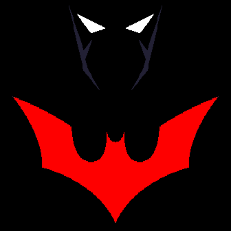

# Batman Beyond 

## Features
- **Red Stylish Animated Icon**: Adds a dynamic and visually appealing element to the watch face.
- **Batman Beyond Battery Indicator**: Keep an eye on your battery life with a custom Batman-themed indicator.
- **Batman Background**: A sleek and minimalist Batman background for a bold look.
- **Track Heart Rate (HR)**: Monitor your heart rate with ease.
- **Battery Level**: Stay informed about your watch's battery status.
- **Time and Date**: Always know the current time and date at a glance.

**Batman Beyond** is a stylish and futuristic watch face that pays homage to the iconic animated series. This watch face features a red stylish animated icon, a Batman Beyond battery indicator, a sleek Batman background, and the ability to track heart rate, battery, time, and date. Stay tuned for more features in the future...beyond!

---

## Future Features
We are constantly working to improve and expand the functionality of **Batman Beyond**. Stay tuned for more exciting features!

---

## Installation
You can install this watch face by visiting the [Fitbit Gallery](https://gallery.fitbit.com/details/d6646e43-c8f3-4f99-a87c-335f0c2dc838).

---

## Contribution
This project was created by me. If you would like to contribute, please feel free to submit a pull request.  
Please make sure to credit me for the original work.

---

## About the Project
This is my first clockface project.  
I used the following tools to help me:

- **Sublime Text**  
  

- **GitHub Desktop**  
  

- **Aseprite**  
  

I learned a lot during development, and I hope you do too.

---

Enjoy your **Batman Beyond** watch face and embrace the future of style and functionality!